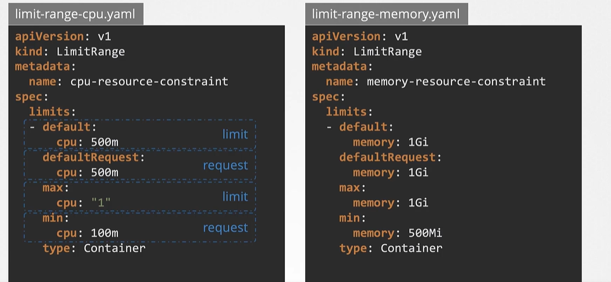

# CKA

---


**Commands**

| Command     | Description |
|-------------|-------------|
| kubectl drain {nodename}                                | To drain a node in cluster                                    |
| kubectl cordon {nodename}                               | To make the node as unschedulable                             |
| kubectl uncordon {nodename}                             | To make the node back as schedulable                          | 
| cat /etc/*release*                                      | To check the linux distriuction                               | 

---

### ***Scheduling***

---

### ****Taints and Tolerations****

Taints are applied to nodes and tolerations are applied to pods.

- When a node is tainted it means the node is not available for pods and only pods with toleration to taint can be scheduled on tainted node.
- When a pod is have a specific toleration it can very well go into the tainted node if not it will have to look for other nodes.

To taint a node

**Command**: kubectl taint node <nodename> key=value:taint-effect

taint effects can be NoSchedule|PreferNoSchedule|NoExecute

```yaml

apiVersion: v1
kind: Pod
metadata:
  name: frontend-pod
  labels:
    - name: nginx-pod
spec:
  containers:
  - name: nginx-container
    image: nginx
  tolerations:
  - key: "app"
    operator: "Equal"
    value: "Blue"
    effect: "NoSchedule"
```

To check if taints exist on node : **kubectl describe node node01 | grep Taint**  


---
#### ****Node Affinity****


***Question***:Set Node Affinity to the deployment to place the pods on node01 only.

Name: blue

Replicas: 3

Image: nginx

NodeAffinity: requiredDuringSchedulingIgnoredDuringExecution

Key: color

value: blue

```yaml

apiVersion: apps/v1
kind: Deployment
metadata:
  labels:
    app: blue
  name: blue
spec:
  replicas: 3
  selector:
    matchLabels:
      app: blue
  template:
    metadata:
      labels:
        app: blue
    spec:
      containers:
      - image: nginx
        name: nginx
        resources: {}
      affinity:
        nodeAffinity:
          requiredDuringSchedulingIgnoredDuringExecution:
            nodeSelectorTerms:
            - matchExpressions:
              - key: color
                operator: In
                values:
                - blue


```
**Question**
Create a new deployment named red with the nginx image and 2 replicas, and ensure it gets placed on the controlplane node only.

Use the label key - node-role.kubernetes.io/control-plane - which is already set on the controlplane node.

```yaml

apiVersion: apps/v1
kind: Deployment
metadata:
  name: red
spec:
  replicas: 2
  selector:
    matchLabels:
      run: nginx
  template:
    metadata:
      labels:
        run: nginx
    spec:
      containers:
      - image: nginx
        imagePullPolicy: Always
        name: nginx
      affinity:
        nodeAffinity:
          requiredDuringSchedulingIgnoredDuringExecution:
            nodeSelectorTerms:
            - matchExpressions:
              - key: node-role.kubernetes.io/control-plane
                operator: Exists


```

---

### ****Requests and Limits****


**Limit Ranges** : Help set for default values set for containers in pod. Its set at namespace level.




**Resource Quotas**: Total number of resources to be consumed can be restricted using resource quota.


----
#### ****Static Pods****

Static pods are used whenver there is no kube api server or master.

The path where the pod definition files need to be kept is shown below.

---

### ***Scheduling***

----
#### ****Static Pods****

Static pods are used whenver there is no kube api server or master.

The path where the pod definition files need to be kept is shown below.

**Path** = **/etc/kubernetes/manifests**

We can only create PODS this way not replicasets, deployments.

In **kubelet.service** file there is a parameter where you specify the value.

**--pod-manifest-path** = /etc/kubernetes/manfiests \\ or **--config** =kubeconfig.yaml\\ **--kubeconfig** = /var/lib/kubelet/kubeconfig \\ where inside the yaml file you mention. 


> kubeconfig.yaml
>
>**staticPodPath** : /etc/kubernetes/manifests

**Static pods are not dependent on control plane we can use static pods to deploy control plane components as pods on cluster**


**Differences between static pods and Daemon Sets**
| Static Pods | Daemon Sets |
|-------------|-------------|
| Created by Kubelet                                 | Created by kubeapi server                                     |
| Best suited for deploying control plane components | Best suited for deploying monitoring agents, log aggregations |
| Ignored by kube-scheduler                          | Ignored by kube-scheduler                                     | 


**To create a static pod definition file**: kubectl run --restart=Never --image=busybox static-busybox --dry-run=client -o yaml --command -- sleep 1000 > /etc/kubernetes/manifests/static-busybox.yaml

---

### ***Logging and Monitoring***

Kubernetes previously had heapster that is used for logging and monitoring but its deprecated.

Metrics server is monitoring service available currently on kubernetes that is in-memory. We can only view current metrics but historical  data will not be available for that we can make use of propreitary tools like Datadog, Prometheus etc.

kubelet also contains a sub-component called **Cadvisor** which is responsible for retrieving perforamnce metrics from PODS and exposing them through the kubelet api for metrics to be available for metrics server.

**Metrics server**= https://github.com/kubernetes-incubator/metrics-server.git

git clone https://github.com/kubernetes-incubator/metrics-server.git
kubectl create -f deploy/1.8+/

kubectl top node
kubectl top pod


---

### ***Application Lifecycle Management ***


To check the status of rollout use the command **kubectl rollout {nameofdeployment}**.

To see the history of rollout **kubectl rollout {nameofdeployment}**.


**Deployment Startegy**

Default deployment strategy is rolling update. There is another strategy which is recreate.

**kubectl apply -f {deploymentdefinition.yaml}**.

**kubectl set image {nameofdeployment} {updated version}** -> **kubectl set image deployment/myapp-deployment \nginx-container=nginx:1.9.1**.


**kubectl describe deployment** can be used to identify if the deployment is rolling or recreate.


**kubectl get replicasets**.

To undo the rollout of deployment we use the command **kubectl rollout undo {nameofdeployment}**


**CMD** parameter in docker works in a way where in the runtime parameters will replace the CMD parameters defined in docker file.

**ENTRYPOINT** parameter in docker works in a way where in the run time parameters get appended to entrypoint command.


> docker file: ubuntusleep
>
> from ubuntu
>
> CMD ["sleep","5"]
>
> docker run ubuntusleep sleep 10
>
> docker file: ubuntusleep 
>
> from ubuntu
>
> ENTRYPOINT ["SLEEP"]
>
> docker run ubuntusleep 5 
>
> The value 5 gets appended to sleep command

Environment variables are defined in three ways:

- **Plain Key value pairs**
- **Config maps**
- **Secret keys**

**Config maps**

The config maps are key value pairs which can store value and we can refer these config maps in pod definition file for parsing environment values

apiVersio: v1
kind: ConfigMap
metadata:
  name: app-config
data:
  APP_COLOR: blue
  APP_MODE: prod


**To create a pod definition out a running pod : kubectl get pod <pod-name> --output=yaml > pod-definition.yaml**

**Multi-Container Pods**

Monolithic application is huge and hard to maintain. 

The application needs to be broken down to small micro-services that can be managed easily and scaled up.

In a multi-container pod a webserver and log agent are placed in a single pod sothat the logs agent can collect logs sent by the webserver.


```yaml

apiVersion: v1
kind: Pod
metadata:
  name: multi-container-pod
spec:
  containers:
    - name: webserver
      image: nginx
      ports:
        - containerPort: 8080 
    - name: logagent
      image: log-agent

```

Let us assume an application hosted on a pod **app** which is in **elastic-stack** namespace and that app outputs logs into **/log/app.log**
To check the logs output **kubectl -n elastic-stack exec -it app -- cat /log/app.log** or **kubectl exec -ti app --namespace=elastic-stack -- cat /log/app.log**


**Init containers**

In a multi container suppose you want a container A to complete the process prioto container B to start we place container A under init containers section.

In the below example we want to ensure the clone is completed first prior to application starting, so we place cloning container under initContainers section.

```yaml

apiVersion: v1
kind: Pod
metadata:
  name: myapp-pod
  labels:
    app: myapp
spec:
  containers:
  - name: myapp-container
    image: busybox:1.28
    command: ['sh', '-c', 'echo The app is running! && sleep 3600']
  initContainers:
  - name: init-myservice
    image: busybox
    command: ['sh', '-c', 'git clone <some-repository-that-will-be-used-by-application> ; done;']

```

---

### ***Cluster Maintenance***

Whenver a node goes down the pods inside the node also goes down.
If the node comes back online within 5 minutes the pods will be made available on that node.

Suppose if the node does not come back online the pods will be evicted. The time it takes to for the pods to be come back online is pod eviction timeout.

Default pod eviction timeout is 5 minutes. If a node goes offline master node waits for 5 minutes to check if the node comes back online.

**Kubernetes Software Versions**

All the control plane components (kubeapi server, kubelet, kubeproxy, kubescheduler, controller-manager) have same versions but etcd and corends have different versions as they are part of a different project.

**Version upgrade in Kubernetes**

kubeapi server is the heart of all control plane components. So you should always have it as the highest version.

The controller-manager and kubescheduler can be one version lesser than kubeapi server but never greater than kubeapi server version.

The kubelet and kubeproxy can be two versions lower than kubeapi server but never greater than kubeapi server version.


The server upgrade process complexity depends on how its setup.

If the kubernetes is setup on cloud managed platform like GKE the process will be pretty staright forward.

If the kubernetes is setup using kubeadm tool, you have to upgrade the kubeadm tool first, then master node and then worker nodes.

**Note**: When you upgrade the nodes using the kubeadm tool only controlplane components get upgraded not the kubelet so you have to explicitly upgrade kubelet when upgrading using the kubeadmin tool.

When setup your cluster using the kubeadm tool all the control plane components will be deployed as pods in master node therefore there is a presence of kubelet on master node when using the kubeadm tool.

Execute the command **kubeadm plan** which lists all the components that gets upgraded and components that will be upgraded manually.

---

**Process to Upgrade the controlplane components to exact version v1.27.0**


**apt update**
This will update the package lists from the software repository.

**apt-get install kubeadm=1.27.0-00**
This will install the kubeadm version 1.27.0

**kubeadm upgrade apply v1.27.0**
This will upgrade Kubernetes controlplane node.

**apt-get install kubelet=1.27.0-00**
This will update the kubelet with the version 1.27.0


**systemctl daemon-reload**
**systemctl restart kubelet**
You may need to reload the daemon and restart kubelet service after it has been upgraded.

---

**To upgrade node01 follow the below steps**

If you are on controlplane ssh into node01
**ssh nodeo1**


**apt update**
This will update the package lists from the software repository.

**apt-get install kubeadm=1.27.0-00**
This will install the kubeadm version 1.27.0

**kubeadm upgrade node**
This will upgrade Kubernetes worker node.

**apt-get install kubelet=1.27.0-00**
This will update the kubelet with the version 1.27.0 because kubelet will not updated by kubeadm.


**systemctl daemon-reload**
**systemctl restart kubelet**
You may need to reload the daemon and restart kubelet service after it has been upgraded.

---

**Backup and Restore Methods**

ETCDCTL is key-value data store that has the data of entire configuration in kubernetes cluster like info on nodes, pods etc..

Backup can be done by getting a entire resoure configuration in a single and restoring the cluster using the below command:

**kubectl get all --all-namespaces -o yaml > configurations.yaml**

The other way of backing up is by using the below methods:

**Querying the kube-api server**
**Backing up the ETCD cluster**

Most of the times in real time we won't be having access to the ETCD cluster.

Incase we have follow up the below steps to back up the ETCD cluster:

**ETCDCTL_API=3 etcdctl \
    snapshot save snapshot.db**

A snapshot file by the name snapshot.db is saved in the current directory.

To restore the cluster from this backup.
First stop the kube-apiserver service

**service kube-apiserver stop**

Restore from backup
**ETCDCTL_API=3 etcdctl \
  snapshot restore snapshot.db \
  --data-dir /var/lib/etcd-from-backup**

When we do this it initializes a new cluster and configures the members as new members in newly created cluster. This is to prevent a new member from accidentally joining a old cluster.

We update the etcd.service file to add the new directory
--data-dir = /var/lib/etcd-from-backup

Reload the service daemon
**systemctl reload daemon-reload**

Restart the etcd service
**service etcd restart**

---

**Security**

**Authorization**

Node;ABAC;RBAC;Webhook

RBAC: Where you create a role and assign this role to user.

Webhook: If you want to delegate the job of authorization to external entity like openconnect we use webhook.

RBAC: Role->Rolebinding->User

Role includes apiGroups,resources,verbs,resourcenames


